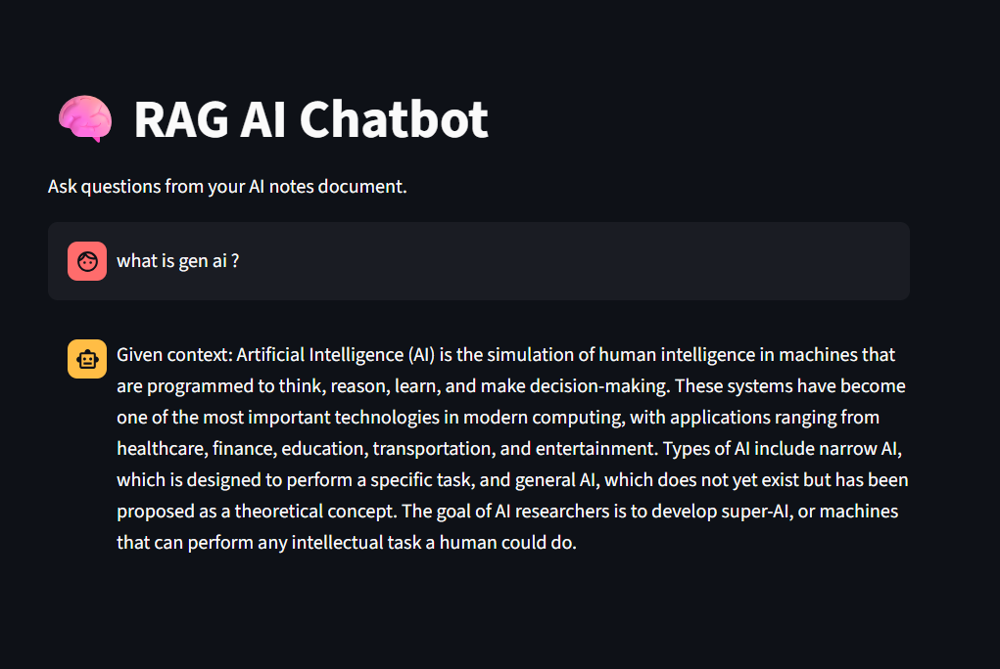

 RAG AI Chatbot - 

 What's This Project About?

Imagine you have a huge pile of notes or documents. Normally, you'd have to manually read through everything to find answers. But what if you could just ask a question and get an instant, intelligent response? That's what this chatbot does!

 Retrieval-Augmented Generation (RAG): 
1. Reads your document
2. Breaks it into digestible chunks
3. Converts those chunks into something AI can understand (embeddings)
4. Stores them in a super-fast search engine (FAISS)
5. When you ask a question, it finds the most relevant bits
6. Uses a local AI model to generate a smart answer

Workflow:
You Ask a Question
        ↓
AI Converts Your Question into Embeddings
(Think of it like translating to a language computers understand)
        ↓
FAISS Hunts Down Similar Information
(It's like a super-intelligent Ctrl+F)
        ↓
Top Matching Chunks Get Retrieved
(The most relevant info rises to the top)
        ↓
A Smart Prompt Gets Built
(Context + Your Question = Magic Recipe)
        ↓
TinyLlama LLM Generates an Answer
(Running locally through Ollama)
        ↓
You See the Answer in Your Browser
(Beautiful Streamlit UI)

 Toolkit:

 Language:
Python - Your coding best friend

 Libraries:
 Streamlit- Makes building web apps stupid easy
 FAISS - The speed demon for searching through vectors
 Sentence Transformers** - Turns text into numerical representations (embeddings)
 NumPy - Math operations on steroids
 Requests - For making HTTP calls when needed

 The Brains (AI Models)
all-MiniLM-L6-v2 - A lightweight embedding model that punches above its weight
TinyLlama - A tiny but mighty language model (runs locally via Ollama)

 Tools:
Ollama - Makes running local LLMs ridiculously simple
GitHub - For version control 

 Project Folder Structure:
RAG-AI-Chatbot/
│
├── data/                          # Your documents live here
│   └── ai_notes.txt              # Example: Your AI notes
│
├── streamlit_app.py              # The main chatbot app
├── requirements.txt              # All the libraries you need
├── README.md                      # This file (but original version)
└── .gitignore                     # Files to hide from Git

Installation Steps

 Step 1: Grab the Code
 git clone <your-github-repository-link>

 Step 2: Go Into the Folder
 cd RAG-AI-Chatbot

 Step 3: Install Everything You Need
 pip install -r requirements.txt

Install Ollama

1. Download Ollama from [https://ollama.com](https://ollama.com)
2. Install it (it's a one-click process)
3. Pull TinyLlama by running this in your terminal:

ollama pull tinyllama

How to Run the Project:

streamlit run streamlit_app.py

 Test It Out (Sample Questions to Try)

Don't just stare at it—ask it things! Here are some example questions to get you started:

What is Artificial Intelligence?
What are the different types of AI?
Can you explain Generative AI in simple terms?
How is AI being used in healthcare?
What's the difference between Narrow AI and General AI?
Show me some real-world applications of AI.

Screenshots:
)

 What I Discovered Building This

This project was an absolute game-changer for understanding how modern AI actually works:

 Embeddings - How computers understand meaning in text  
 Semantic Search - Finding stuff by what it *means*, not just keywords  
 Vector Databases - Super-fast searching through thousands of pieces of info  
 RAG Architecture - Combining retrieval and generation for smarter AI  
 Prompt Engineering - How to ask AI the right questions  
 Local LLMs - Running powerful models without cloud services  
 Building with Streamlit - Making AI apps that actually look good  

